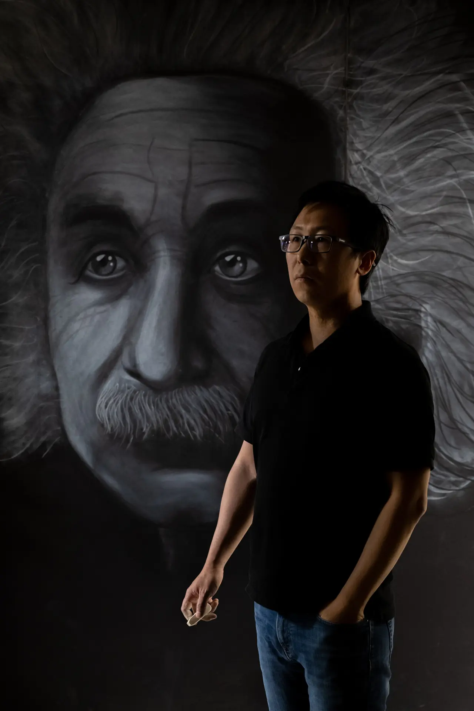
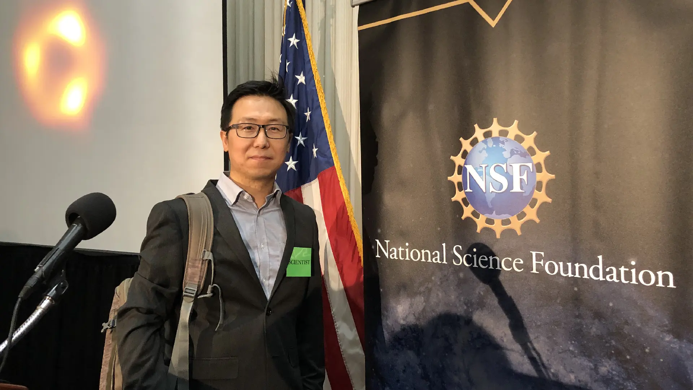

{button}`Full CV <assets/ckc_cv.pdf>`

*Google Scholar Rank*:
Computational astrophysics [**#21**](https://scholar.google.com/citations?view_op=search_authors&hl=en&mauthors=label:computational_astrophysics&after_author=FT2EAIyw__8J&astart=20),
AI for Science             **#28**,
Gravitation                **#29**,
Visualization              **#39**,
Radio Astronomy            **#39**;
*citations*:    [**19,000+**](https://scholar.google.com/citations?hl=en&user=27yWbOYAAAAJ);
*h-index*:      **47**;
*i10-index*:    **82**;
*publications*: **110+**.

```{grid} 1 2 2 2

Continuing status (tenure-equivalent) Computational Astrophysicist and
AI-for-Science researcher working at the intersection of machine
learning and large-scale scientific computing.
Faculty member in
[Astronomy](https://astro.arizona.edu/person/chi-kwan-ck-chan),
Data Science, and
[Applied Mathematics](https://appliedmath.arizona.edu/person/chi-kwan-chan).
Leader of the
[Event Horizon Telescope (EHT) Collaboration](https://eventhorizontelescope.org/),
a large-scale international consortium recognized for imaging black
holes, and architect of its computational and data-processing
infrastructure.
Developed scalable algorithms and AI-driven methods to accelerate
scientific inference, automate data processing, and enable discovery
from petabyte-scale datasets.
Principal Investigator of EHT-MOVIE, aimed to produce the first
time-resolved movies of black holes.
Department of Energy INCITE reviewer; evaluated AI-and
simulation-driven projects for access to the world's most powerful
supercomputers.
Avid hiker; biked across the continental United States on the
TransAmerica Trail.



```


## Honors and Awards



* 2025&emsp;The Biggest Scientific Breakthroughs of the Last 25 years, National Geographic
* 2025&emsp;Frontiers of Science Award
* 2021&emsp;EHT Early Career Award
* 2021&emsp;Royal Astronomical Society Group Award
* 2020&emsp;Breakthrough Prize in Fundamental Physics
* 2020&emsp;Nelson P. Jackson Aerospace Award
* 2020&emsp;Bruno Rossi Prize
* 2020&emsp;Einstein Medal
* 2019&emsp;Special Congressional Recognition (U.S. Senate)
* 2019&emsp;Special Congressional Recognition (U.S. House)
* 2019&emsp;American Ingenuity Award in Physical Sciences
* 2019&emsp;NSF Diamond Achievement Award
* 2019&emsp;Breakthrough of the Year, Science Magazine
* 2019&emsp;\#1 Science Image of the Year, Nature Magazine
* 2019&emsp;\#1 Scientific Moments that Defined 2019, Popular Mechanics
* 2010&ndash;2012&emsp;NORDITA Fellowship
* 2007&ndash;2010&emsp;Harvard ITC Fellowship


## Family and Outdoor

```{grid} 1 2 2 2

I am a dad of two.
My wife and I met in Boston, and we enjoys spending time outdoors.
My connection to the outdoors began early.
Growing up in a working-class family in Hong Kong, my father often
took our family hiking and fishing on weekends.
Simple, affordable outings that became some of my fondest memories.
I was a
[Scout](https://www.facebook.com/tw8scout)
as a teenager, where I developed outdoor and leadership skills that
continue to shape how I engage with the outdoors.\
\
After moving to the United States, I continued these activities, often
organizing hiking and camping trips with friends.
In the summer of 2010, I spent two months
[biking across the United States](https://bikexus.blogspot.com/)
between my Harvard ITC Fellowship and my Nordita Fellowship.\
\
Most recently, I joined
[Troop 211 in Arizona](https://www.instagram.com/troop211az),
where my boys are now Scouts, allowing our family to share time
outdoors while passing along practical skills and a spirit of
exploration.


```